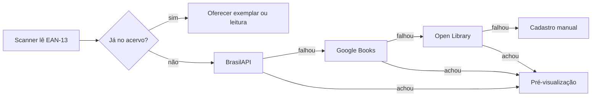

# PRD — App de Biblioteca e Leituras

24 de set. de 2026 · Rodrigo Gil Esteves

## Visão geral

Um app mobile pessoal para catalogar a biblioteca (física e digital) e registrar
todas as leituras, inclusive de livros que não estão no acervo. O cadastro deve
levar menos de 10 segundos via código de barras.

**Problema.** Hoje o acervo físico, os e-books, os audiobooks e os livros lidos
por assinatura ou empréstimo ficam espalhados. Não há histórico confiável de
leitura nem visão de ritmo e metas.

### Objetivos

- Cadastrar um livro físico escaneando o ISBN em até 10 segundos, com capa e
  metadados preenchidos automaticamente.
- Separar a biblioteca em Física e Online (e-books, audiobooks, assinaturas) com
  um toque.
- Registrar leituras de livros emprestados, de assinatura ou que já saíram do
  acervo, sem poluí-lo.
- Gerar relatórios de leitura: volume por período, meta anual, gêneros e autores,
  ritmo e tempo.

**Fora do objetivo.** Rede social, venda de livros e leitura de e-books dentro do app.

## Usuário e escopo

O usuário principal é um leitor frequente, com acervo físico grande e leituras em
Kindle, audiobook e assinaturas, que usa o celular como principal dispositivo. O
app nasce para uso em família (acervo compartilhado, leituras individuais) e será
comercializado depois, então a arquitetura já é multiusuário.

| Funcionalidade | MVP (PWA) | Versão 2 (lojas + venda) |
| --- | :---: | :---: |
| Cadastro por código de barras + busca de ISBN | Sim | |
| Cadastro manual (com foto da capa) | Sim | |
| Biblioteca Física / Online com filtros | Sim | |
| Registro de leituras (acervo e fora do acervo) | Sim | |
| Progresso por página, % ou minutos | Sim | |
| Relatórios e meta anual (livros e páginas) | Sim | |
| Empréstimos que eu faço a terceiros | Sim | |
| Família: acervo compartilhado, leituras e metas por pessoa | Sim | |
| Gêneros das APIs + lista própria editável | Sim | |
| Importação Skoob, Goodreads e planilha (CSV) | Sim | |
| App Android e iOS nas lojas (Expo) | | Sim |
| Planos pagos, assinatura e limites por plano | | Sim |
| Lista de desejos | | Sim |
| Exportação dos relatórios em imagem para Instagram | | Sim |

## Requisitos funcionais

A regra central: **Livro** (a obra) é separado de **Exemplar** (o que eu possuo) e
de **Leitura** (o que eu li). Assim dá para registrar a leitura de um livro
emprestado sem que ele apareça no acervo.

### RF1 — Cadastro por código de barras

- Botão flutuante "Adicionar" abre a câmera direto no leitor EAN-13 (ISBN-13
  começa com 978/979).
- Busca em cascata: BrasilAPI ISBN → Google Books → Open Library. Primeiro
  resultado completo vence.
- Pré-visualização com capa, título, autores, editora, ano, páginas e gênero, tudo
  editável antes de salvar.
- Se o ISBN já existe no acervo, avisar e oferecer "adicionar outro exemplar" ou
  "registrar leitura".
- Modo lote: escanear vários livros em sequência e revisar tudo no fim (útil para
  catalogar a estante inicial).
- Campo para digitar o ISBN manualmente, com validação de dígito verificador
  (ISBN-10 e 13).

### RF2 — Cadastro manual

- Busca por título/autor nas mesmas APIs antes de cair no formulário vazio.
- Formulário com título (obrigatório), autores, editora, ano, páginas, gênero,
  idioma e capa (foto da câmera ou galeria).

### RF3 — Biblioteca Física e Online

- Seletor no topo: Física | Online | Tudo.
- Cada exemplar tem formato: Físico, E-book, Audiobook ou Assinatura.
- Online guarda a plataforma (Kindle, Kobo, Audible, Kindle Unlimited, Skeelo,
  outra) e, para assinatura, se ainda está disponível.
- Físico guarda localização (estante/cômodo), estado, data e valor de compra.
- Visualização em grade de capas ou lista; busca por título, autor ou ISBN.
- Filtros: gênero, autor, status de leitura, plataforma, localização. Ordenação:
  recentes, título, autor, ano.
- Exemplar pode ser marcado como "não tenho mais" (vendido, doado, perdido). Ele
  sai do acervo ativo, mas o histórico de leituras permanece.

### RF4 — Leituras

- Status: Quero ler, Lendo, Lido, Abandonado.
- Uma leitura pode apontar para um exemplar do acervo ou ter origem externa:
  Emprestado (de quem), Biblioteca pública, Assinatura, Já não tenho.
- Suporte a releituras: várias leituras do mesmo livro, cada uma com datas próprias.
- Atualização de progresso em páginas, % (e-book) ou minutos (audiobook), com data
  de cada registro.
- Ao concluir: data de término, nota de 1 a 5 e resenha curta opcional.
- Registro rápido de leitura passada, com término em data anterior (para montar o
  histórico).

### RF5 — Relatórios

- Por período: livros e páginas lidos por mês e ano, com seletor de período.
- Meta anual: meta em livros e em páginas, por pessoa, barra de progresso e
  projeção "no ritmo atual você termina o ano com X livros".
- Gêneros e autores: distribuição por gênero, top autores, proporção físico ×
  online × fora do acervo.
- Ritmo e tempo: dias médios por livro, páginas por dia, horas de audiobook,
  sequência de dias lendo.
- Resumo anual ("Meu ano em leituras") em tela única.

### RF6 — Empréstimos a terceiros

- Em um exemplar físico: "Emprestar" com nome do contato (da agenda ou digitado),
  data e previsão de devolução.
- Exemplar emprestado aparece com selo na biblioteca e numa lista "Emprestados"
  ordenada por atraso.
- Lembrete (notificação push do PWA) na data prevista e botão para enviar mensagem
  de cobrança pelo WhatsApp.
- "Devolvido" fecha o empréstimo; o histórico de quem pegou cada livro fica guardado.

### RF7 — Família

- Cada conta pertence a uma Biblioteca (casa). O dono convida membros por link ou
  e-mail.
- Acervo e empréstimos são compartilhados; leituras, notas, resenhas e metas são
  de cada pessoa.
- Perfis: Dono (tudo, inclusive membros e plano) e Membro (cadastra livros e leituras).
- Relatórios mostram "meus" por padrão e "da família" como opção.

### RF8 — Gêneros

- O gênero vem das APIs e é mapeado para a lista da biblioteca; categorias
  desconhecidas viram sugestão, não gênero novo.
- O dono cria, renomeia, mescla e exclui gêneros; um livro pode ter mais de um.
- Lista inicial em português pronta para editar.

### RF9 — Importação

- Importar CSV do Goodreads (formato de exportação oficial) e do Skoob.
- Importar planilha própria (CSV/XLSX) com tela de mapeamento de colunas.
- Pré-visualização antes de gravar: duplicados detectados por ISBN ou
  título+autor, escolha de "exemplar" ou "só leitura".
- Enriquecimento automático de capa e páginas pelo ISBN após importar.

### Exportação

- Exportação completa em CSV/JSON, para o usuário nunca ficar preso ao app.

## Modelo de dados

O modelo é multi-inquilino desde o início: tudo pertence a uma library (a casa), o
que prepara a comercialização por plano. Todas as tabelas têm `id`, `created_at` e
`updated_at`.

Livros, exemplares, empréstimos e gêneros são da library; leituras e metas são de
cada membro. Uma leitura só aponta para um exemplar quando o livro está (ou esteve)
no acervo.

| Tabela | Campos principais |
| --- | --- |
| libraries | name, owner_id, plan (free/pro), created_at |
| library_members | library_id, user_id, role (owner/member), display_name |
| books | library_id, isbn_13, isbn_10, title, subtitle, authors[], publisher, year, pages, audio_minutes, language, cover_url, source (brasilapi/google/openlibrary/manual/import) |
| genres | library_id, name, parent_id (nullable) |
| book_genres | book_id, genre_id |
| copies | library_id, book_id, format (physical/ebook/audiobook/subscription), platform, location, condition, acquired_at, price, owner_member_id, status (active/sold/donated/lost/expired) |
| loans | copy_id, borrower_name, borrower_phone, lent_at, due_at, returned_at |
| readings | library_id, member_id, book_id, copy_id (nullable), origin (own/borrowed/library/subscription/no_longer_owned), lent_by, status (want/reading/read/abandoned), started_at, finished_at, rating, review |
| reading_progress | reading_id, date, page, percent, minutes |
| goals | member_id, year, target_books, target_pages |
| imports | library_id, source (goodreads/skoob/sheet), file_url, status, rows_total, rows_imported |

## UX/UI

O princípio é "uma mão, dois toques": escanear e atualizar progresso devem estar
sempre a um toque da tela inicial.

Navegação: barra inferior com 4 abas (Início, Biblioteca, Relatórios, Perfil) e um
botão central flutuante de escanear.

| Tela | Conteúdo |
| --- | --- |
| Início | Cards dos livros em leitura com botão "+ progresso", anel da meta anual, últimos adicionados |
| Scanner | Câmera em tela cheia, moldura do código, vibração ao ler, campo "digitar ISBN" |
| Pré-visualização | Capa grande, metadados editáveis, escolha de formato e "já li / lendo / quero ler" |
| Biblioteca | Seletor Física / Online / Tudo, grade de capas, busca, chips de filtro |
| Detalhe do livro | Capa, metadados, exemplares, histórico de leituras, nota e resenha |
| Nova leitura | Origem (meu exemplar / emprestado / assinatura / já não tenho), datas, formato |
| Relatórios | Abas Período, Meta, Gêneros e autores, Ritmo; gráficos de barra, rosca e linha |
| Perfil | Metas, família e convites, gêneros, importar/exportar, tema |

### Visual

- Tema claro e escuro automáticos, cantos arredondados de 16px, capas como protagonistas.
- Tipografia: serifada para títulos (clima de livro) e sans-serif para interface.
- Paleta neutra (papel e tinta) com uma cor de destaque para ações e metas.
- Microinterações: vibração ao escanear, animação ao concluir livro, estados vazios ilustrados.
- Alvos de toque de no mínimo 44px e textos em português do Brasil.

## Arquitetura e stack

Recomendação: Expo (React Native) publicado primeiro como PWA na Vercel, depois nas
lojas pelo EAS, com Supabase no backend. Um único código serve as duas fases, sem
reescrever o app quando for para a Play Store e a App Store.

| Camada | Escolha | Motivo |
| --- | --- | --- |
| App | Expo + Expo Router + TypeScript | Mesmo código gera web (PWA) e apps Android/iOS |
| Estilo | NativeWind (Tailwind para React Native) | Visual moderno e rápido de ajustar |
| Leitor de código | expo-camera no app nativo; @zxing/browser na web | Arquivo por plataforma (scanner.web.tsx / scanner.native.tsx) |
| Backend e banco | Supabase (Postgres, Auth, Storage, Edge Functions) | RLS por library garante isolamento entre famílias e futuros clientes |
| Busca de ISBN | BrasilAPI ISBN, Google Books API, Open Library | BrasilAPI cobre edições brasileiras; as outras completam capa e gênero |
| Gráficos | react-native-gifted-charts (sobre react-native-svg) | Roda na web e no nativo |
| Importação | Edge Function com parser CSV/XLSX | Processa arquivos grandes fora do celular |
| Notificações | Web Push na fase PWA; expo-notifications nas lojas | Lembretes de devolução e de leitura |
| Hospedagem web | Vercel conectada ao GitHub | Cada push publica o PWA |

**Monetização (versão 2):** campo `plan` na library e limites por plano (ex.:
número de livros ou membros). Na web, cobrança via Stripe ou Mercado Pago; nas
lojas, Apple e Google exigem compra dentro do app, então o ideal é RevenueCat
unificando as três fontes. Lojas custam US$ 25 (Google, uma vez) e US$ 99/ano (Apple).

### Fluxo de busca do ISBN (Edge Function no Supabase)

A busca roda no servidor para esconder a chave do Google Books e guardar em cache o
resultado por ISBN.

### Entrega no Claude Code (fases grandes, cada uma publicável)

1. **Base completa:** projeto Expo, Supabase, login, libraries e convites de
   família, tabelas com RLS, PWA instalável, navegação e tema.
2. **Acervo:** scanner, busca de ISBN, modo lote, cadastro manual, gêneros
   editáveis, biblioteca Física/Online, empréstimos com lembretes.
3. **Leituras e relatórios:** status, origens externas, progresso, metas em livros
   e páginas, as quatro abas de relatórios.
4. **Importação e exportação:** Goodreads, Skoob, planilha com mapeamento de
   colunas, exportação CSV/JSON.
5. **Versão 2:** builds EAS para as lojas, planos pagos e RevenueCat.

Incluir um CLAUDE.md no repositório com este PRD resumido, o modelo de dados e as
convenções (pt-BR, Tailwind, nomes em inglês no código).

## Requisitos não funcionais

- **Desempenho:** abrir o app em até 2 s em 4G; leitura do código em até 1 s;
  busca de ISBN em até 3 s.
- **Offline:** biblioteca e leituras consultáveis sem internet (cache no service
  worker); cadastros exigem conexão no MVP.
- **Segurança:** login por e-mail (link mágico) ou Google; RLS garantindo que cada
  usuário só vê seus dados.
- **Dados:** exportação completa em CSV/JSON a qualquer momento; backup do Supabase.
- **Acessibilidade:** contraste AA, alvos de 44px, suporte ao tamanho de fonte do sistema.

## Métricas de sucesso

| Métrica | Alvo |
| --- | --- |
| Tempo médio de cadastro por código de barras | até 10 s |
| ISBNs encontrados automaticamente | 85% ou mais |
| Acervo físico catalogado | 100% no primeiro mês |
| Leituras com progresso atualizado ao menos 1x por semana | 80% |

## Decisões tomadas

| Tema | Decisão |
| --- | --- |
| Usuários | Uso em família no MVP; produto comercial depois |
| Empréstimos a terceiros | No MVP, com lembretes |
| Plataforma | PWA primeiro, depois Android e iOS nas lojas |
| Biblioteca Online | E-books (Kindle/Kobo), audiobooks e assinaturas (Kindle Unlimited, Skeelo) |
| Meta anual | Livros e páginas, por pessoa |
| Gêneros | Vindos das APIs, com lista própria editável |
| Importação | Goodreads, Skoob e planilha própria |
| Relatórios | Período, meta anual, gêneros e autores, ritmo e tempo |
| Construção | Claude Code |
